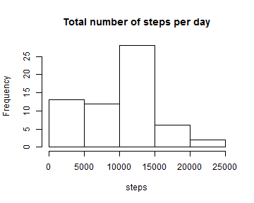
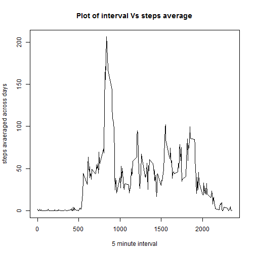
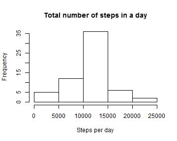
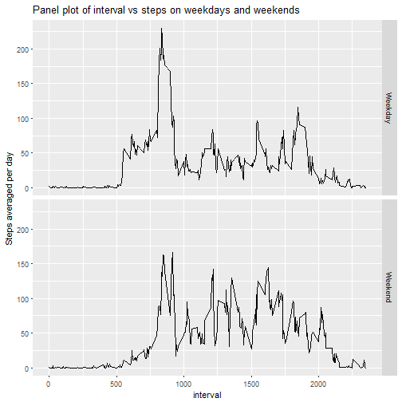

#Assignment

This assignment performs various analysis on the data collected about personal movement using activity monitoring devices such as fitbit,nike,fuelband or Jawbone Up.


Let's load the data into a dataset called "input". We will use this dataset throughout this assignment.


```r
input <- read.csv("E:/datascience/ReproducibleResearch/activity.csv",stringsAsFactors = FALSE)
```
Now lets start with analysing the data, in the order given in the assignment problem.

###Mean number of steps taken per day

First create a new dataset from input dataset which calculates total number of steps each day.

```r
input <- mutate(input,date=as.Date(date))
input<- group_by(input,date)
input_sum <- summarise(input,steps=sum(steps,na.rm = TRUE))
```

Now let us make a histogram of total number of steps from the "output" dataset.

```r
hist(input_sum$steps,xlab = "steps",main = "Total number of steps per day")
```



We can Calculate the mean and median of total number of steps from the "output" dataset using the summary command

```r
summary(input_sum$steps)
```

```
##    Min. 1st Qu.  Median    Mean 3rd Qu.    Max. 
##       0    6778   10400    9354   12810   21190
```
###Average daily activity pattern

Now lets calculate the mean of each interval across dates using the "summarise" function 

```r
input <- group_by(input,interval)
mean_val <- summarise(input,meanval=mean(steps,na.rm=TRUE))
head(mean_val)
```

```
## # A tibble: 6 × 2
##   interval   meanval
##      <int>     <dbl>
## 1        0 1.7169811
## 2        5 0.3396226
## 3       10 0.1320755
## 4       15 0.1509434
## 5       20 0.0754717
## 6       25 2.0943396
```

```r
#Time series plot of average number of steps taken averaged across all days in dataset.
with(mean_val,plot(interval,meanval,type = "l",xlab = "5 minute interval",ylab="steps avaeraged across days",main = "Plot of interval Vs steps average"))
```



The 5 minute interval for which has the maximum number of steps can be calculated as below.


```r
mean_val[mean_val$meanval==max(mean_val$meanval),]
```

```
## # A tibble: 1 × 2
##   interval  meanval
##      <int>    <dbl>
## 1      835 206.1698
```

##Imputing Missing values

To calculate the no of missing values in the dataset lets load the dataset into "input" and use rowSums command to calculate the no of missing values

```r
input <- read.csv("activity.csv",stringsAsFactors = FALSE)
length(rowSums(is.na(input)))
```

```
## [1] 17568
```

One observation we can make is that there are no missing values in columns except the "steps" column of the dataset, which makes it easy for us to impute the missing values. We can verify that using the below code


```r
length(input[is.na(input$date)])
```

```
## [1] 0
```

```r
length(input[is.na(input$interval)])
```

```
## [1] 0
```


So Lets fill the mising values in the "steps" column. The most ideal method would be to replace the mising values with their means corresponding to their respective intervals.

For this we will use the datasset "mean_val" we already created which has the mean value of steps calcuated for each interval.
We will crate a new dataset from "input" which will contain only rows with missing values for "steps"

```r
input_na <- input[is.na(input$steps),]
```

We will then merge the datasets input_na and mean_val,assign the missing values with the mean value for the steps and then select the required columns.

```r
input_na <- merge(input_na,mean_val,by.x = "interval",by.y = "interval")
input_na <- select(mutate(input_na,steps=meanval),1:3)
```

Now that we have replaced the missing values for "steps" with their respective means we will merge this resultant dataset "input_na" with non missing values of "input" to form the new dataset "output"

```r
output <- rbind(input_na,input)
head(output)
```

```
##   interval    steps       date
## 1        0 1.716981 2012-10-01
## 2        0 1.716981 2012-11-30
## 3        0 1.716981 2012-11-04
## 4        0 1.716981 2012-11-09
## 5        0 1.716981 2012-11-14
## 6        0 1.716981 2012-11-10
```

###Calculating total number of steps each day from the new dataset

We have already done this at the begining of the document for the original dataset "input". We will repeat the same here for the new datset "output"

```r
output_1 <- group_by(output,date)
output_sum <- summarise(output_1,steps=sum(steps,na.rm = TRUE))
hist(output_sum$steps,xlab = "Steps per day",main = "Total number of steps in a day")
```



###Comparison of mean and median from the original dataset

We will just take the summary of respective datasets to compare the mean and median

```r
summary(input_sum$steps)
```

```
##    Min. 1st Qu.  Median    Mean 3rd Qu.    Max. 
##       0    6778   10400    9354   12810   21190
```

```r
summary(output_sum$steps)
```

```
##    Min. 1st Qu.  Median    Mean 3rd Qu.    Max. 
##      41    9819   10770   10770   12810   21190
```

We can see thatimputing the missing values have resulted in better mean and median values and for the new datset mean and median are equal.

###Differences in activity patterns between weekdays and weekends

For doing this first we will add a factor variable called "days" to the "output" dataset which will have two values weekdays and weekends

```r
output <- mutate(output,date=as.Date(date))
weekends <- c("Saturday","Sunday")
head(output)
```

```
##   interval    steps       date
## 1        0 1.716981 2012-10-01
## 2        0 1.716981 2012-11-30
## 3        0 1.716981 2012-11-04
## 4        0 1.716981 2012-11-09
## 5        0 1.716981 2012-11-14
## 6        0 1.716981 2012-11-10
```

```r
output$day <- factor((weekdays(output$date) %in% weekends),levels= c(FALSE,TRUE),labels = c("Weekday","Weekend"))
table(output$day)
```

```
## 
## Weekday Weekend 
##   14688    5184
```

```r
#Calculating mean value of steps for each interval and weekend or weekday
output <- group_by(output,interval,day)
output_avg <-summarise(output,step_avg=mean(steps,na.rm=TRUE))
```


```r
ggplot(output_avg,aes(x=interval,y=step_avg)) + geom_line() + facet_grid(day~.) + ylab("Steps averaged per day") + ggtitle("Panel plot of interval vs steps on weekdays and weekends")
```




